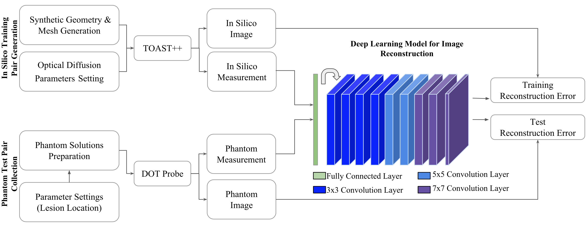

# Deep learning based image reconstruction for diffuse optical tomography
"DOTNet", the software repository of [our](https://link.springer.com/chapter/10.1007/978-3-030-00129-2_13) [paper](#cite), addressing the problem of reconstructing images acquired by limited angle diffuse optical tomography using deep learning.

## Motivation
Diffuse optical tomography (DOT) is a relatively new imaging modality that has demonstrated its clinical potential of probing tumors in a non-invasive and affordable way. 
Image reconstruction is an ill-posed challenging task because knowledge of the exact analytic inverse transform does not exist a priori, especially in the presence of sensor non-idealities and noise. 
Standard reconstruction approaches involve approximating the inverse function and often require expert parameters tuning to optimize reconstruction performance. 
In this work, we evaluate the use of a deep learning model to reconstruct images directly from their corresponding DOT projection data. 
The inverse problem is solved by training the model via training pairs created using physics-based simulation. 
Both quantitative and qualitative results indicate the superiority of the proposed network compared to an analytic technique.



The overall architecture of the proposed model is shown on the right, where the arrow after the first fully connected layer represents the reshaping procedure before the convolution layers. Note that the model was only trained on synthetic data and we kept the phantom data for evaluation.

## Keywords
Diffuse optical tomography, inverse problem, image reconstruction, deep learning, tissue estimation, handheld probe.

## Citation
<a name="Cite"></a>
```bibtext
@inproceedings{ben2018deep,
  title={Deep learning based image reconstruction for diffuse optical tomography},
  author={Ben Yedder, Hanene and BenTaieb, A{\"\i}cha and Shokoufi, Majid and Zahiremami, Amir and Golnaraghi, Farid and Hamarneh, Ghassan},
  booktitle={Machine Learning for Medical Image Reconstruction: First International Workshop, MLMIR 2018, Held in Conjunction with MICCAI 2018, Granada, Spain, September 16, 2018, Proceedings 1},
  pages={112--119},
  year={2018},
  organization={Springer}
}
```
## Table of contents
1. [Contribution](#contribution)
2. [Installation](#install)
3. [Training](#Training)
5. [Questions?](#faq)

### Contribution
<a name="contribution"></a>
- Propose the first end-to-end deep learning model for near-infrared-based optical imaging.
- Leverage a physics-based optical diffusion simulation to generate in silico training datasets. 
- Train the reconstruction model using in silico data only and test it on real measurements acquired from a phantom dataset subject to sensor non-idealities and noise.
- Show the utility of our synthetic data generation technique in mimicking real measurements and the generalization ability of our model to unseen phantom datasets.
  
### Installation
<a name="install"></a>

```bash
git clone https://github.com/haneneby/DOTNet.git  
cd DOTNet
conda env create -f requirement.yml --name DOTNet
conda activate DOTNet
```

### Training

<a name="Training"></a>
```bash
export CUDA_VISIBLE_DEVICES=0 #or change to your GPU config
mkdir myoutput
cd DOTNet
python3 DOTNet.py      

```
By passing an input measurement through a set of nonlinear transformations one can reconstruct the equivalent image. The proposed architecture consists of a dense layer followed by a set of convolution layers which are designed to efficiently combine features from the first layer with those of deeper layers. Training the architecture of our proposed model will show something like:


```bash
Epoch 1/100
  16/3739 [..............................] - ETA: 34:23 - loss: 1.7838
```

### Questions?
<a name="faq"></a>
Please create a [new issue](https://github.com/haneneby/DOTNet/issues/new/choose) detailing concisely, yet complete what issue you encountered, in a reproducible way.

