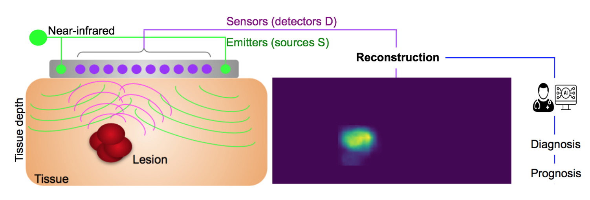

# Limited-Angle Diffuse Optical Tomography Image Reconstruction using Deep Learning
This is the software repository "DOTNet" for [our](https://link.springer.com/chapter/10.1007/978-3-030-32239-7_8) [paper](#cite) s addresses the problem of reconstructing breast cancer lesions in acquired diffuse optical tomography data by leveraging cross-domain learning.

## Motivation
Diffuse optical tomography (DOT) leverages near-infrared light propagation through in vivo tissue to assess its optical properties and identify abnormalities such as cancerous lesions. While this relatively new optical imaging modality is cost-effective and non-invasive,
its inverse problem,i.e., recovering an image from raw signal measurements, is ill-posed, due to the highly diffusive nature of light propagation in biological tissues and limited boundary measurements. Solving the inverse problem becomes even more challenging in the case of limited-angle data acquisition given the restricted number of sources and sensors, the sparsity of the recovered information, and the presence of noise, representative of real world acquisition environments. Traditional optimization-based reconstruction methods are computationally intensive and thus too slow for real-time imaging applications. We propose a novel image reconstruction method for breast cancer DOT imaging. Our method is highlighted by two components: (i) a deep learning network with a novel hybrid loss, and (ii) a distribution transfer learning module. Our model is designed to focus on lesion specific information and small reconstruction details to reduce reconstruction loss and lesion localization errors. The transfer learning module alleviates the need for real training data by taking advantage of cross-domain learning. Both quantitative and qualitative results demonstrate that the proposed method's accuracy surpasses existing methods' in detecting tissue abnormalities.



A Workflow example for DOT image reconstruction: Illumination, detection, and estimation of optical coefficients in tissue.
Light propagation and scattering in the tissue are schematized. DOT reconstructed image shows the optical coefficients in the tissue. The success of diagnosis and treatment relies on accurate reconstruction and estimation of the optical properties of a medium.

## Keywords
Diffuse optical tomography,inverse problem, image reconstruction, deep learning, tissue estimation, Fuzzy Jaccard, transfer learning, handheld probe.

## Citation
<a name="Cite"></a>
```bibtext
@inproceedings{ben2019limited,
  title={Limited-angle diffuse optical tomography image reconstruction using deep learning},
  author={Ben Yedder, Hanene and Shokoufi, Majid and Cardoen, Ben and Golnaraghi, Farid and Hamarneh, Ghassan},
  booktitle={Medical Image Computing and Computer Assisted Intervention--MICCAI 2019: 22nd International Conference, Shenzhen, China, October 13--17, 2019, Proceedings, Part I 22},
  pages={66--74},
  year={2019},
  organization={Springer}
  doi={https://doi.org/10.1007/978-3-030-32239-7_8}}
```
## Table of contents
1. [Contribution](#contribution)
2. [Installation](#install)
3. [Training](#Training)
4. [Questions?](#faq)

### Contribution
<a name="contribution"></a>
- We investigate the benefits of end-to-end deep learning on the quality of limited-data acquisition DOT reconstruction.
- We introduce a similarity-wise loss that focuses on lesion-specific information and small reconstruction details to reduce reconstruction loss and improve lesion localization accuracy.
- To bridge the gap between real-world acquisition and in silico data simulation, we employ transfer learning. We assess the model's ability to generalize to unseen data, accounting for sensor non-idealities and noise.

### Installation
<a name="install"></a>

```bash
git clone https://github.com/haneneby/DOTNet.git  
cd DOTNet
conda env create -f requirement.yml --name DOTNet
conda activate DOTNet
```
### Training

<a name="Training"></a>
```bash
export CUDA_VISIBLE_DEVICES=0 #or change to your GPU config
mkdir myoutput
cd DOTNet
python3 DOTNet.py --epochs 100 --outputfolder ../myoutput.      

```
```
This will show something like:
```bash
Epoch 1/100
  16/3739 [..............................] - ETA: 34:23 - loss: 1.7838
```

### Questions?
<a name="faq"></a>
Please create a [new issue](https://github.com/haneneby/DOTNet/issues/new/choose) detailing concisely, yet complete what issue you encountered, in a reproducible way.
